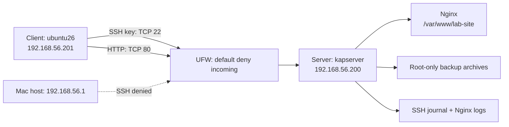

# Secure Linux Web Server Lab

[](https://github.com/ayush10x/secure-linux-web-server-lab/actions/workflows/checks.yml)

An Ubuntu ARM64 administration lab built on an M2 Pro Mac with two VirtualBox VMs. Nginx serves a static site; a separate Client VM administers the Server using an Ed25519 key. UFW restricts SSH to that Client and HTTP to the private lab subnet.

This project demonstrates Linux service management, network configuration, least privilege, OpenSSH hardening, firewall validation, logging, shell automation, and backup recovery. It is a private-network learning environment, not an internet-facing production deployment.

## Review the project

| Document | What it provides |
|---|---|
| [Project report](docs/project-report.md) | Design, decisions, verified outcomes, and limitations |
| [Recruiter brief](docs/recruiter-brief.md) | Skills demonstrated and interview discussion points |
| [Downloadable PDF](output/pdf/secure-linux-web-server-report.pdf) | Compact report for sharing and review |
| [Test evidence](docs/verification-evidence.md) | Commands, observed outputs, and interpretations |
| [Lab record](docs/lab-record.md) | Actual VM configuration and acceptance results |
| [Setup guide](docs/setup-guide.md) | Reproduction commands and recovery precautions |
| [Operations guide](docs/operations-guide.md) | Checks, backup, restoration, and rollback |
| [Action and decision log](docs/action-log.md) | What was done, why, and the observed result |

## Architecture



Both VMs use NAT for package downloads and the same host-only network for lab traffic. Fixed addresses `.200` and `.201` sit outside its DHCP pool. The Server has 2 CPUs, 3 GB RAM, and a 25 GB virtual disk; the Client has 2 CPUs, about 4.4 GB RAM, and its preserved 25 GB disk.

## Verified behavior

- Client HTTP requests return 200; an absent page returns 404 and is logged.
- A dedicated Client key authenticates `ayush`; sudo was verified in a fresh key session.
- Root, password-only, and `webuser` SSH attempts are denied.
- UFW allows SSH from `.201` and HTTP from the lab subnet. A Mac-host SSH probe times out and creates a firewall log entry.
- The health check returns zero; a backup checksum and temporary restore comparison pass.

The full record includes reboot checks and package status. CI validates Bash syntax, ShellCheck, and required files. VM acceptance tests are recorded separately because GitHub CI cannot reach the local guests.

## Reproduce

Start with [the setup guide](docs/setup-guide.md). On a fresh Server with a recovery snapshot:

```bash
sudo bash scripts/install-server.sh --apply
```

Prove key login and sudo in a second session, then follow the SSH and UFW steps. Run the Client checks using the actual private address:

```bash
bash scripts/verify-client.sh 192.168.56.200
bash scripts/verify-security.sh 192.168.56.200 "$HOME/.ssh/server_ayush"
```

No passwords, private keys, VM images, or credential-bearing logs belong in this repository. The dedicated lab key is unencrypted on the Client with restrictive permissions; a passphrase or hardware-backed key is a production improvement. HTTP carries the static demonstration page over the private lab network.

## Ownership and context

Built for Ayush Kaushik as an assisted Linux administration portfolio project. Codex assisted setup and troubleshooting, and the documented tests were executed against the local guests. This lab does not claim production operating experience.
